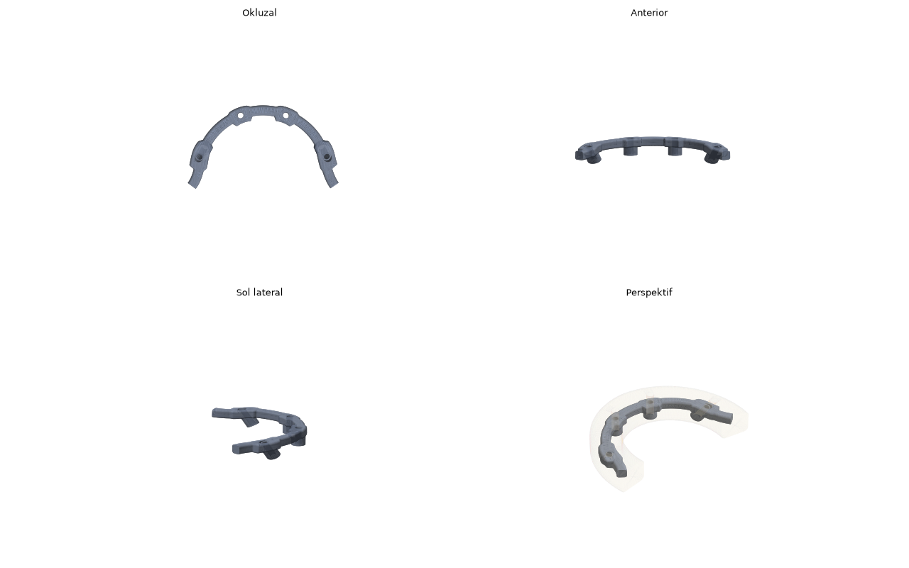
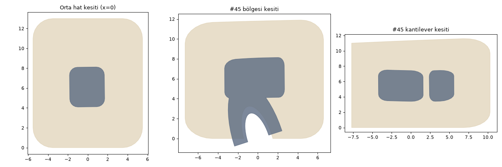

# PRIMER AUTO BAR V1

İmplant üstü full-arch hibrit protezin içinden **otomatik titanyum bar** üreten yazılım.

Videodaki operatörün tıklamalarını kopyalamaz; verdiği **geometrik kararları** hesaplar:
"burada protez inceliyor → barı linguale çek", "distal uzantı burada bitmeli",
"vida kanalının çevresinde yeterli metal kalmalı" gibi.

```
Restorasyon STL + implant eksenleri
  → güvenli hacim (derinlik alanı)        "safety zone"
  → otomatik merkez hattı (2 turlu optimizasyon)
  → bar kesiti + implant pedleri
  → Ti silindirler + vida kanalı + vida başı yuvası (boolean)
  → mesh temizliği (manifold)
  → hibrit iç boşluğu (restorasyon − bar − siman aralığı)
  → QA raporu (PASS / FAIL + bölge bölge gerekçe)
  → STL
```




Örnek çıktı: [docs/ornek_qa_raporu.txt](docs/ornek_qa_raporu.txt)

> **Uyarı:** Çıktı bir tıbbi cihaz parçasıdır. QA raporu PASS olsa bile üretime göndermeden önce
> teknisyen/hekim kontrolü zorunludur.

---

## Kurulum

Python 3.10+:

```bash
cd autobar
pip install -r requirements.txt
```

`embreex` opsiyoneldir ama analizi belirgin hızlandırır.

## Kullanım

### Komut satırı

```bash
python -m primer_autobar run \
    --restoration vaka/hibrit.stl \
    --implants vaka/implants.json \
    --params examples/params.json \
    --out vaka/cikti
```

Sentetik bir alt çene All-on-4 vakasıyla deneme (iki distal implant 30° eğik):

```bash
python -m primer_autobar demo --out demo_cikti
```

Program PASS olursa 0, FAIL olursa 2 koduyla çıkar.

### Blender

1. `Edit > Preferences > Add-ons > Install…` ile `blender/primer_autobar_addon.py` dosyasını kurup etkinleştir.
2. 3D görünümde `N` → **AutoBar** sekmesini aç.
3. **Restorasyon:** Full-arch hibrit protez mesh'ini seç.
4. **İmplantlar:** Her implant için bir Empty olan koleksiyonu seç.
   - Konumu: MUA/implant platformunun merkezi.
   - Yerel **Z ekseni:** Platformdan protezin okluzaline doğru implant ekseni.
   - Adı: Diş numarası (`36`, `Implant_36` vb.).
   - **İmplant ekle** butonu, 3D imlecin konum ve yönünde böyle bir Empty oluşturur.
5. **Python:** trimesh/manifold3d/scipy kurulu Python'u gir. **Paket klasörü:** Bu `autobar` klasörünü gir.
6. **Barı Oluştur:** `Ti_Bar` ve `Hibrit_Kesilmis` nesneleri sahneye gelir. Tam rapor
   *Metin Düzenleyici → AutoBar_QA* içindedir.

Birim: 1 Blender birimi = 1 mm (dental CAD STL'leri genelde böyledir).

---

## Girdiler

**Restorasyon STL:** Bitmiş full-arch hibrit protezin **kapalı (watertight)** tek gövdeli mesh'i.
Dış yüzey ve intaglio (doku tarafı) birlikte olmalı. Protezde vida giriş delikleri varsa sorun
olmaz: analiz için otomatik doldurulurlar.

**implants.json:**

```json
{
  "units": "mm",
  "implants": [
    {"id": "35", "platform": [20.82, 12.94, 0.0], "axis": [0.234, -0.442, 0.866]},
    {"id": "32", "platform": [8.12, 24.14, 0.0],  "axis": [0, 0, 1]}
  ]
}
```

- `platform`: MUA/implant platform merkezi (barın oturduğu nokta).
- `axis`: Platformdan protezin okluzaline doğru birim vektör.

Restorasyon ve implantlar aynı koordinat sisteminde olmalı (CAD'den aynı vaka olarak dışa aktarılmış).

## Çıktılar

| Dosya | İçerik |
|---|---|
| `bar.stl` | Üretime gidecek Ti bar (manifold, tek gövde, diske yazılıp geri okunarak doğrulanır) |
| `restoration_cut.stl` | Hibrit (zirkonyum/kompozit) kısım: restorasyon − (bar + siman aralığı) − vida giriş delikleri |
| `qa_report.txt` / `.json` | PASS/FAIL, tüm kontroller, bölge bölge kararlar |
| `bar_centerline.csv` | Optimize edilmiş bar merkez hattı |

---

## Notlardaki adımların yazılımdaki karşılığı

| Videodaki adım | Modül | Nasıl yapılıyor |
|---|---|---|
| 1. Vaka geometrisi | `io.py` | STL onarımı ve kapalılık kontrolü, implant eksenleri |
| 2. Barın geçeceği hat | `centerline.py` | Okluzal düzlem restorasyonun PCA'sından bulunur (eğik implantlar yanıltmasın). İmplantlar ark boyunca sıralanır, platformlardan kılavuz spline geçirilir |
| 3. Bar eğrisi / kontrol noktası düzeltme | `centerline.py` | Her 1 mm'de kılavuza dik kesitte, bar kesitinin sığabileceği tüm (bukko-lingual, yükseklik) konumları için restorasyon içi min. derinlik hesaplanır. Dinamik programlama ile "örtüyü maksimize et + ani yön değişimini cezalandır" çözülür. İkinci turda kesitler gerçek bar eksenine dik alınır |
| 4. İmplant bölgeleri, distal açı | `centerline.py`, `builder.py` | İmplant istasyonunda bar eksenden en fazla `max_offset_at_implant` uzaklaşabilir. Eğik implantta ped, eksenin bar seviyesindeki gerçek konumuna (distale kayar) yerleşir |
| 5. Dikey pozisyon | `centerline.py` | Z de optimizasyon değişkeni: bar altında ve üstünde min. örtü korunur, mümkünse dikeyde ortalanır |
| 6. Kesit / kalınlık | `geometry.py`, `builder.py` | Yuvarlatılmış dikdörtgen kesit süpürülür. İmplant üstünde ped implant eksenine ortalanır |
| 7. Anterior/posterior kontrol | `centerline.py` | Kesit genişliği (pedler dahil) her istasyonda ayrı değerlendirilir |
| 8. Çakışma kontrolü | `field.py`, `qa.py` | Mesafe alanı ile: bar yüzeyinden 40.000 noktada restorasyon dış yüzeyine kesin mesafe |
| 9. Vida kanalları | `builder.py` | Kanal + **eksene dik** vida başı yuvası (eğik kanalın bar üstünde bıçak sırtı ağız bırakmaması için) |
| 10. Boolean | `geometry.py` | `manifold3d` motoru: her zaman kapalı manifold sonuç |
| 11. Smoothing | `centerline.py` | Spline düzgünleştirme + yerel fairing (min. eğrilik yarıçapı) |
| 12. Hibrit boşluğu | `builder.py` | Bar `cement_gap` kadar büyütülerek restorasyondan çıkarılır |
| 13. Safety zone | `config.py`, `qa.py` | `min_cover`, `min_ti_thickness`, kantilever limitleri |
| 14. Remesh / temizlik | `geometry.finalize` | Mikro kenarlar manifold korunarak çökertilir. STL float32 yuvarlamasında bozulmaz |
| 15. Son kontrol | `qa.py` | Aşağıdaki QA listesi |
| 16. Çıktı | `pipeline.py` | STL + rapor |

### Yazılımın "kararları"

Rapor, operatörün kafasındaki düşünceyi açıkça yazar:

```
#35 distali (kantilever): bar merkezi platformdan 5.6 mm yukarıda; implant kılavuz hattına göre
ort. 3.95 mm linguale/palatinale kaydırıldı (min. örtü -1.3 → 2.7 mm)
```

Yani: implantlardan geçen hat üzerinde kalsaydı bar protezin dışına 1.3 mm taşacaktı. Yazılım
barı 3.95 mm linguale taşıdı ve örtü 2.7 mm'ye çıktı.

### QA kontrolleri

| Kontrol | FAIL koşulu |
|---|---|
| Mesh | Watertight değil / manifold değil / birden fazla gövde |
| Restorasyon örtüsü | Bar yüzeyinin herhangi bir yerinde restorasyon dış yüzeyine mesafe < `min_cover` (taşma ayrıca raporlanır). Silindirin protez tabanından çıkan kısmı hariç |
| Ti duvar kalınlığı | Yüzeyden içeri ölçülen metal kalınlığı < `min_ti_thickness` |
| Keskin kenar (uyarı) | < 0.3 mm metal ucu olan kenarlar, CAM'de pah önerisi |
| Kanal/yuva cidarı | Vida kanalı ya da vida başı yuvası çevresinde metal < `min_ti_thickness` |
| Bağlantı | Bar merkezinin implant ekseninden sapması > `max_offset_at_implant` |
| Kantilever (uyarı) | Distal uzantı > min(`max_cantilever`, `cantilever_ap_ratio` × A-P) |
| Eğrilik (uyarı) | Merkez hattı eğrilik yarıçapı < `min_bend_radius` |
| Freze | Kesit köşe radyüsü < takım yarıçapı |

Her bulgu diş bölgesiyle raporlanır: `#36 bölgesi`, `#32–#42 arası`, `#45 distali (kantilever)`.

---

## Parametreler

Tümü mm. Tam liste ve varsayılanlar: [`primer_autobar/config.py`](primer_autobar/config.py),
örnek dosya: [`examples/params.json`](examples/params.json).

| Parametre | Varsayılan | Anlamı |
|---|---|---|
| `bar_width` / `bar_height` | 3.5 / 4.0 | Bar kesiti |
| `corner_radius` | 0.8 | Kesit köşe radyüsü |
| `sleeve_diameter` | 5.0 | Implant (MUA) üstü Ti silindir |
| `channel_diameter` | 2.2 | Vida kanalı |
| `seat_diameter` | 3.0 | Vida başı yuvası (eksene dik oturma yüzeyi) |
| `pad_extra` | 0.6 | Ped genişliği = silindir çapı + bu değer |
| `min_cover` | 2.0 | Bar çevresinde minimum restoratif materyal |
| `min_ti_thickness` | 1.2 | Minimum Ti duvar kalınlığı |
| `cement_gap` | 0.05 | Hibrit iç boşluğunda siman aralığı |
| `max_cantilever` | 15 | Maksimum distal uzantı |
| `cantilever_ap_ratio` | 1.5 | Kantilever ≤ oran × A-P mesafesi |
| `max_offset_at_implant` | 1.2 | Bar ile implant ekseni arasındaki maksimum yatay sapma |
| `smooth_weight` | 2.0 | Arttıkça bar daha az yön değiştirir |
| `vertical_bias` | 0 | >0: barı gingivaya, <0: okluzale yakın tercih et |
| `tool_diameter` | 1.0 | En küçük freze takımı |

---

## Testler

```bash
pip install pytest
python -m pytest
```

Testler şunları kapsar: sentetik All-on-4 vakasının PASS vermesi ve STL'lerin kapalı çıkması,
kantileverlerin limit içinde kalması, ve bilerek dar bırakılmış ön bölgede yazılımın **FAIL**
verip sorunlu bölgeyi (#32/#42) göstermesi.

## V1 sınırları / V2 yol haritası

- **İmplant eksenleri girdi olarak verilir.** Scan body/MUA kütüphanesiyle otomatik tespit V2'de.
- **MUA arayüzü düz silindir tabanla temsil edilir.** Üreticiye özel bağlantı geometrisi
  (konik oturma, hex) kütüphaneden boolean ile eklenmeli.
- **Bar–silindir iç köşeleri radyüssüz.** CAM takım yarıçapı kadar yuvarlar; QA uyarı verir.
- **Freze erişilebilirliği (undercut, takım açısı) analiz edilmiyor.** Sadece köşe radyüsü kontrol ediliyor.
- **Testler sentetik vakayla yapıldı.** Gerçek vakalarla (senin elle açtığın barlarla karşılaştırarak)
  parametre kalibrasyonu gerekiyor.
- **Yapay zekâ henüz yok.** Vaka sınıflandırma ve anatomik landmark tespiti V2'de.
